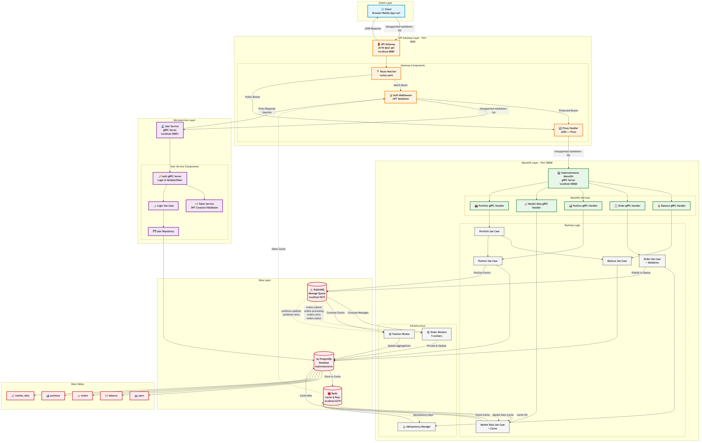

# HubInvestments System Architecture



## Overview

HubInvestments is a microservices-based financial trading platform with a hybrid architecture combining an API Gateway pattern with a monolithic backend service. The system handles user authentication, order management, position tracking, balance management, and real-time market data.

---

## 🏗️ Architecture Layers

### 1. Client Layer
- **Components**: Web browsers, mobile apps, API clients (curl, Postman)
- **Protocol**: HTTP/HTTPS
- **Format**: JSON
- **Entry Point**: API Gateway on port 8080

### 2. API Gateway Layer
- **Port**: 8080
- **Protocol**: HTTP → gRPC
- **Role**: Single entry point for all client requests

#### Components:
1. **Route Matcher** (`routes.yaml`)
   - Maps HTTP paths to gRPC services
   - Supports path parameters (`/orders/{id}`)
   - Configures authentication requirements

2. **Auth Middleware**
   - Validates JWT tokens
   - Caches token validation results in Redis
   - Adds user context to requests

3. **Proxy Handler**
   - Converts JSON → Protobuf
   - Invokes gRPC services
   - Converts Protobuf → JSON
   - Unwraps `api_response` wrapper

### 3. Microservices Layer

#### User Service (Port 50051)
**Purpose**: Authentication and user management

**Components**:
- **Auth gRPC Server**: Handles `Login` and `ValidateToken` RPCs
- **Token Service**: JWT creation and validation
- **Login Use Case**: Business logic for authentication
- **User Repository**: Database access layer

**Database Tables**:
- `users`: User credentials and profile information

**Key Features**:
- JWT token generation (10-minute expiration)
- Bcrypt password hashing
- Token validation with claims extraction

### 4. Monolith Layer (Port 50060)

#### HubInvestments Monolith
**Purpose**: Core business logic for trading operations

**gRPC Services**:

1. **Balance Service**
   - `GetBalance`: Retrieves user account balance
   - Returns available, total, and reserved balance

2. **Order Service**
   - `SubmitOrder`: Creates new trading orders
   - `GetOrderDetails`: Retrieves order information
   - `GetOrderStatus`: Checks order status
   - `CancelOrder`: Cancels pending orders
   - Features: Idempotency, async processing, validation

3. **Position Service**
   - `GetPositions`: Lists user positions
   - `GetPositionAggregation`: Aggregated position data
   - `CreatePosition`: Internal position creation
   - `UpdatePosition`: Internal position updates

4. **Market Data Service**
   - `GetMarketData`: Real-time market data for symbols
   - `GetAssetDetails`: Detailed asset information
   - `GetBatchMarketData`: Bulk market data retrieval
   - Features: Redis caching with 5-minute TTL

5. **Portfolio Service**
   - `GetPortfolioSummary`: Combined balance + positions
   - Aggregates data from Balance and Position services

#### Background Workers

1. **Order Workers** (5 instances)
   - Process orders asynchronously
   - Consume from RabbitMQ queues:
     - `orders.submit`
     - `orders.processing`
     - `orders.retry`
     - `orders.status`
   - Update order status in database
   - Publish position events

2. **Position Worker** (1 instance)
   - Processes position updates
   - Consumes from RabbitMQ queues:
     - `positions.updates`
     - `positions.retry`
   - Updates position aggregations
   - Calculates P&L

#### Infrastructure Components

1. **Idempotency Manager**
   - Stores idempotency keys in Redis
   - Prevents duplicate order submissions
   - TTL-based key expiration

---

## 🔄 Request Flow Examples

### Example 1: User Login

```
1. Client → API Gateway
   POST /api/v1/auth/login
   { "email": "user@example.com", "password": "secret" }

2. API Gateway → User Service (gRPC)
   AuthService.Login(LoginRequest)

3. User Service:
   - Validates credentials against database
   - Generates JWT token
   - Returns LoginResponse with token

4. User Service → API Gateway (gRPC Response)
   { token: "eyJhbGc...", userId: "123", email: "user@example.com" }

5. API Gateway → Client (JSON)
   { "token": "eyJhbGc...", "userId": "123", "email": "user@example.com" }
```

### Example 2: Get Balance (Authenticated)

```
1. Client → API Gateway
   GET /api/v1/balance
   Authorization: Bearer eyJhbGc...

2. API Gateway - Auth Middleware:
   - Extracts JWT token
   - Calls User Service ValidateToken (gRPC)
   - Caches validation result in Redis
   - Adds user context to request

3. API Gateway → Monolith (gRPC)
   BalanceService.GetBalance(GetBalanceRequest { userId: "123" })

4. Monolith:
   - Queries balance table
   - Returns balance data

5. Monolith → API Gateway (gRPC Response)
   GetBalanceResponse { balance: { available: 1000, total: 1000, ... } }

6. API Gateway → Client (JSON)
   { "available_balance": 1000, "total_balance": 1000, ... }
```

### Example 3: Submit Order (Async Processing)

```
1. Client → API Gateway
   POST /api/v1/orders
   { "symbol": "AAPL", "order_type": "MARKET", "order_side": "BUY", "quantity": 10 }

2. API Gateway → Monolith (gRPC)
   OrderService.SubmitOrder(SubmitOrderRequest)

3. Monolith - Order Use Case:
   - Validates symbol exists
   - Checks user balance
   - Stores idempotency key in Redis
   - Creates order record (status: PENDING)
   - Publishes to RabbitMQ: orders.submit

4. Monolith → API Gateway (gRPC Response)
   SubmitOrderResponse { orderId: "order-123", status: "PENDING" }

5. Background: Order Worker
   - Consumes from orders.submit queue
   - Validates market conditions
   - Updates order status: PROCESSING → EXECUTED
   - Creates/updates position
   - Publishes position event to RabbitMQ

6. Background: Position Worker
   - Consumes position event
   - Updates position aggregations
   - Calculates unrealized P&L
```

---

## 💾 Data Layer

### PostgreSQL Database (`hubinvestments`)

**Tables**:

1. **users**
   - User credentials (email, hashed password)
   - User profile information
   - Created/updated timestamps

2. **balance**
   - User account balances
   - Available, total, reserved amounts
   - Currency information

3. **orders**
   - Order details (symbol, type, side, quantity, price)
   - Order status (PENDING, PROCESSING, EXECUTED, CANCELLED)
   - Timestamps (created, updated, executed)
   - Market data at submission

4. **positions**
   - User positions (symbol, quantity, average price)
   - Position type (LONG, SHORT)
   - Status (ACTIVE, PARTIAL, CLOSED)
   - P&L calculations

5. **market_data**
   - Symbol information
   - Current prices
   - Asset details

### Redis (Port 6379)

**Usage**:

1. **Token Validation Cache**
   - Key: `token_valid:<hash>`
   - TTL: 5 minutes
   - Reduces load on User Service

2. **Market Data Cache**
   - Key: `market_data:<symbol>`
   - TTL: 5 minutes
   - Improves market data response time

3. **Idempotency Keys**
   - Key: `idempotency:<key>`
   - TTL: 24 hours
   - Prevents duplicate order submissions

### RabbitMQ (Port 5672)

**Queues**:

1. **Order Processing**:
   - `orders.submit`: New orders
   - `orders.processing`: Orders being processed
   - `orders.retry`: Failed orders for retry
   - `orders.status`: Status updates

2. **Position Management**:
   - `positions.updates`: Position changes
   - `positions.retry`: Failed position updates

**Features**:
- Durable queues
- Message persistence
- Dead letter queues for failed messages
- Automatic retry with exponential backoff

---

## 🔐 Security

### Authentication Flow

1. **Login**: User provides credentials → receives JWT token
2. **Token Validation**: API Gateway validates token with User Service
3. **Token Caching**: Validated tokens cached in Redis (5 min)
4. **User Context**: User ID and email added to all downstream requests

### JWT Token

- **Algorithm**: HS256
- **Expiration**: 10 minutes
- **Claims**: `userId`, `username`, `exp`
- **Secret**: Shared between User Service and API Gateway

### Security Features

- Bcrypt password hashing (cost: 10)
- Token expiration validation
- Protected routes require authentication
- User context propagation via gRPC metadata

---

## 📊 Performance Optimizations

### Caching Strategy

1. **Token Validation Cache** (Redis)
   - Reduces User Service load by 90%+
   - 5-minute TTL balances performance and security

2. **Market Data Cache** (Redis)
   - Cache-aside pattern
   - 5-minute TTL for real-time data freshness
   - Reduces database queries

### Async Processing

1. **Order Processing**
   - Orders submitted synchronously (fast response)
   - Processing happens asynchronously (workers)
   - Decouples submission from execution

2. **Position Updates**
   - Event-driven updates
   - Workers process in background
   - Aggregations calculated asynchronously

### Connection Pooling

- Database connection pool (configurable)
- Redis connection pool (10 connections)
- gRPC connection reuse

---

## 🚀 Scalability

### Horizontal Scaling

**Can Scale**:
- ✅ API Gateway (stateless)
- ✅ User Service (stateless with Redis cache)
- ✅ Order Workers (5 workers, can add more)
- ✅ Position Workers (can add more)

**Single Instance**:
- ⚠️ Monolith gRPC Server (can be split into microservices)
- ⚠️ PostgreSQL (can add read replicas)
- ⚠️ Redis (can add Redis Cluster)
- ⚠️ RabbitMQ (can add cluster nodes)

### Load Balancing

- API Gateway: Can run multiple instances behind load balancer
- gRPC Services: Round-robin load balancing
- Workers: RabbitMQ distributes messages across workers

---

## 🔧 Technology Stack

| Component | Technology | Version |
|-----------|-----------|---------|
| **API Gateway** | Go | 1.21+ |
| **User Service** | Go | 1.21+ |
| **Monolith** | Go | 1.21+ |
| **Database** | PostgreSQL | 14+ |
| **Cache** | Redis | 7+ |
| **Message Queue** | RabbitMQ | 3.12+ |
| **RPC Framework** | gRPC | 1.59+ |
| **Serialization** | Protocol Buffers | 3 |
| **Authentication** | JWT (HS256) | - |

---

## 📈 Monitoring & Observability

### Metrics (Prometheus)

- Request count by route
- Request duration by service
- Cache hit/miss ratio
- Circuit breaker state
- Worker queue depth
- Database connection pool stats

### Logging

- Structured logging (JSON format)
- Request/response logging
- Error logging with stack traces
- Performance logging

### Health Checks

- `/health`: Gateway health
- `/metrics`: Prometheus metrics
- Service-level health checks

---

## 🔄 Data Flow Summary

```
Client Request (JSON)
    ↓
API Gateway (HTTP)
    ↓
Route Matching & Auth
    ↓
JSON → Protobuf Conversion
    ↓
gRPC Call to Service
    ↓
Business Logic Processing
    ↓
Database/Cache Operations
    ↓
Async Workers (if needed)
    ↓
Protobuf → JSON Conversion
    ↓
Client Response (JSON)
```

---

## 📝 Key Design Decisions

1. **API Gateway Pattern**: Single entry point, protocol translation
2. **Hybrid Architecture**: Microservices for auth, monolith for business logic
3. **gRPC for Internal Communication**: Type-safe, efficient, HTTP/2
4. **Async Order Processing**: Better user experience, scalable
5. **Redis Caching**: Reduced latency, lower database load
6. **RabbitMQ for Events**: Reliable, durable, retryable
7. **Idempotency**: Prevents duplicate orders, safe retries

---

## 🎯 Future Enhancements

1. **Service Decomposition**: Split monolith into microservices
2. **Event Sourcing**: Complete audit trail of all changes
3. **CQRS**: Separate read/write models
4. **GraphQL Gateway**: Alternative to REST
5. **Service Mesh**: Istio/Linkerd for observability
6. **Distributed Tracing**: OpenTelemetry integration
7. **Multi-Region**: Geographic distribution
8. **Read Replicas**: Scale database reads

---

**Generated**: October 21, 2025  
**Diagram**: `architecture-diagram.png` (Mermaid)  
**Status**: Production Architecture 🚀

